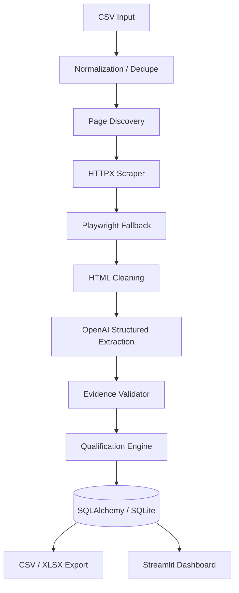

# SignalScout

AI-Powered Web Research & Qualification System

## Overview

SignalScout is a portfolio/demo project showing how public-web scraping, structured LLM
extraction, and deterministic Python business logic can be combined into one auditable
research and qualification pipeline - the kind of internal tool a freelance developer might
build for a client's sales or research team. It is intentionally scoped as a small, working
MVP rather than a production SaaS: a handful of companies in, a reviewed and exportable
shortlist out.

## What It Does

Given a CSV of companies, SignalScout visits each company's public website, discovers a
handful of useful pages (homepage, about, product, careers, news/blog), scrapes and cleans
their content, and asks an LLM to extract structured "buying signal" evidence (hiring, AI
adoption, expansion, product launches, technology changes, partnerships) strictly from that
scraped text. Every piece of evidence the model returns is then checked in Python against the
actual scraped source before it's allowed to count toward anything - and the final High /
Medium / Low qualification is decided by deterministic Python logic, not the LLM. Results land
in SQLite, are exportable to CSV/XLSX, and are reviewable in a Streamlit dashboard where a
human can approve, reject, or flag any company with a persisted note.

## Pipeline

```
CSV
  → normalization/dedupe
  → discovery
  → HTTP scraping
  → Playwright fallback
  → cleaning
  → structured LLM extraction
  → evidence validation
  → deterministic qualification
  → SQLite
  → dashboard/export
```

## Evidence-First AI Design

This is the project's main differentiator: the LLM is never trusted as a source of truth.

- The model only ever sees the specific scraped page content it's given (tagged as
  `[SOURCE:P1]`, `[SOURCE:P2]`, ...) - never outside knowledge.
- Every signal the model returns must reference a `source_id` and include a short
  `evidence_quote` copied from that source.
- After extraction, Python re-checks every `evidence_quote` against the actual scraped text
  for that `source_id` using normalized substring matching.
- Evidence that doesn't check out is marked invalid and stored anyway (for auditability) - but
  it **cannot** contribute to qualification.
- Final qualification (High / Medium / Low) and manual-review flags are computed entirely by
  deterministic Python rules over the validated evidence - the model classifies, Python decides.

## Architecture



## Features

- CSV ingestion with row-level validation and stdlib-only URL/domain normalization + dedupe
- Keyword-based page discovery (about/product/careers/news) with optional common-path fallback
- httpx scraping with retries, timeout, and graceful handling of blocked/failed pages
- Playwright (Chromium) fallback, triggered only when successfully-fetched content is too thin
  to be real (never opens every page in a browser)
- Reusable HTML → text cleaner (strips script/style/nav/footer noise, keeps headings/paragraphs/lists)
- Structured extraction via the OpenAI Responses API + Pydantic (`client.responses.parse`)
- Evidence validator with normalized substring matching, unit-tested against real/fabricated quotes
- Deterministic qualification engine (High/Medium/Low + categorical confidence + manual-review flag)
- SQLite persistence via SQLAlchemy (companies → scans → pages/evidence → assessment), with full
  scan history retained across rescans
- CSV + 3-sheet XLSX export (Companies / Evidence / Scan Summary)
- Streamlit review dashboard: KPIs, filters, sortable results table, per-company detail view
  (overview, why-qualified, signals, evidence, pages inspected, scan history), and a persisted
  manual-review workflow (status + reviewer note)
- Console + rotating file logging of every pipeline stage
- Unit tests for normalization, HTML cleaning, evidence validation, and qualification logic

## Tech Stack

Python 3.10+, httpx, BeautifulSoup4 + lxml, Playwright, Pydantic, OpenAI Python SDK,
SQLAlchemy, pandas, openpyxl, Streamlit, python-dotenv, Typer, PyYAML, pytest.

## Project Structure

```
signalscout/
├── config/research_profile.yaml      # signal list, high-impact signals, qualification thresholds
├── data/
│   ├── sample_companies.csv
│   └── exports/                      # generated CSV/XLSX land here
├── database/                         # generated SQLite file lands here
├── logs/                             # generated log file lands here
├── src/signalscout/
│   ├── cli.py                        # Typer entry point (`run` command)
│   ├── config.py                     # settings + research profile loader
│   ├── models/                       # enums + Pydantic schemas
│   ├── ingestion/                    # CSV loader + URL/domain normalizer
│   ├── scraping/                     # discovery, http fetcher, Playwright fallback, cleaner, orchestrator
│   ├── ai/                           # OpenAI client, prompts, structured extractor (isolated)
│   ├── validation/                   # evidence validator + deterministic qualification
│   ├── database/                     # SQLAlchemy models, engine, repository (all DB access)
│   ├── pipeline/                     # runner - ties every stage together per company
│   └── export/                       # CSV/XLSX exporter
├── dashboard/app.py                  # Streamlit review dashboard
└── tests/                            # unit tests
```

## Setup

```bash
python -m venv .venv

# Windows
.venv\Scripts\activate
# macOS/Linux
source .venv/bin/activate

pip install -e .
playwright install chromium
```

Copy `.env.example` to `.env` and fill in your OpenAI API key (see below).

## Environment Variables

| Variable | Description |
|---|---|
| `OPENAI_API_KEY` | Your OpenAI API key. Required to run the pipeline. Never commit a real key. |
| `OPENAI_MODEL` | Model used for structured extraction (default: `gpt-4o-mini`). |
| `PLAYWRIGHT_ENABLED` | `true`/`false` - globally enable/disable the Playwright fallback. |
| `DATABASE_URL` | SQLAlchemy database URL (default: `sqlite:///database/signalscout.db`). |

## Running the Pipeline

```bash
python -m signalscout run --input data/sample_companies.csv
```

Useful flags:

| Flag | Description |
|---|---|
| `--input` | Path to the companies CSV (default: `data/sample_companies.csv`). |
| `--limit` | Only process the first N companies. |
| `--playwright / --no-playwright` | Enable/disable the Playwright fallback for this run. |
| `--force-rescan` | Rescan companies even if a completed scan already exists. |

## Running Tests

```bash
pytest tests/
```

## Running the Dashboard

```bash
streamlit run dashboard/app.py
```

## Output

- **SQLite** (`database/signalscout.db`) - companies, scans (full history), pages, evidence
  (validated and invalid alike), and assessments, including manual-review status/notes.
- **CSV / XLSX** (`data/exports/`) - one company-per-row summary (CSV and the "Companies" XLSX
  sheet), plus "Evidence" and "Scan Summary" sheets in the XLSX.
- **Logs** (`logs/signalscout.log`) - every stage of every scan: discovery, fetch success/failure,
  Playwright fallback, AI extraction, evidence accepted/rejected, qualification, export.

## Limitations

- This is a portfolio/demo MVP, not a production SaaS.
- Only public, non-authenticated website content is researched - no login walls, no CAPTCHA or
  anti-bot circumvention of any kind.
- Crawl scope is intentionally small: at most 5 pages per company (homepage + 4 discovered
  types), not a general-purpose crawler.
- Evidence matching is conservative normalized substring matching - a real, true claim can be
  rejected if the model paraphrases its quote instead of copying it verbatim.
- Domain normalization is stdlib-only (no public-suffix-list library), so multi-part TLDs like
  `.co.uk` are not perfectly distinguished from subdomains.
- No accuracy/precision claims are made about signal extraction - this project has not been
  benchmarked against a labeled dataset.
- Not built or tested for large-scale/high-volume crawling.

## Future Improvements

The following are explicitly **not** implemented and are listed only as possible future
directions:

- Scheduled/recurring rescans
- Content-hash-based change detection between scans
- PostgreSQL/Supabase backend
- Saved, named research projects/profiles
- Notifications (email/Slack) on new signals
- A hosted, multi-user version
